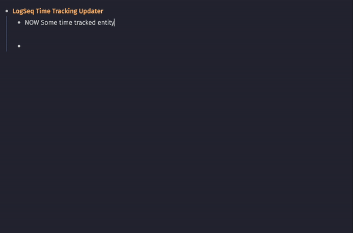

## LogSeq Time Tracking Updater

The LogSeq Time Tracking Updater Plugin makes it easy to update your time tracking data directly in LogSeq. Before, you had to open your page in another app to make changes. With this plugin, you can edit and manage your time tracking data right inside LogSeq, saving time and keeping everything in one place.

> Note: This plugin requires that you have Time Tracking enabled in your LogSeq settings. Please ensure it is activated before using the plugin.

### Demo

Type the `/Update time tracking` on the block that already has time tracking to update it's time tracking data. 

## Installation
1.	Open your LogSeq application.
2.	Navigate to the Plugins section.
3.	Search for “Time Tracking Updater” in the marketplace or manually install it using the repository link.
4.	Enable the plugin and start updating your time tracking data!

### License
MIT
